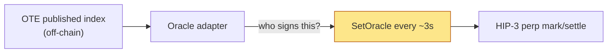

<Warning>
This is **Phase 3** and **optional**. It is the *fastest* route to two-sided liquidity but carries
the project's **two worst risks together**: a deployer-controlled oracle on a single-venue
underlying, and the most US-regulatory-exposed product shape. Do not start here.
</Warning>

## What HIP‑3 gives you

<Check>
Hyperliquid **HIP‑3** (live Oct 13 2025) lets anyone meeting the stake **permissionlessly deploy a
perp market** and **register an arbitrary asset** — including a non-crypto underlying like an
`OTE-token-price` index. Builder-deployed markets reached **$790M+ open interest by Jan 2026**
(gold/silver led). There is **no "economic significance" gate** — the only barrier is economic.
</Check>

| Requirement | Value |
|---|---|
| Stake to deploy | **500,000 HYPE** |
| Register asset | `RegisterAsset2` / `RegisterAsset` |
| Oracle updates | `SetOracle` (`oraclePxs`/`markPxs`/`externalPerpPxs`), **~every 3s** |
| Oracle owner | **The deployer** (protocol does not validate the feed) |

## The core risk: deployer owns the oracle

<Warning>
Whoever calls `SetOracle` **controls mark and settlement.** If OTE self-operates the feed on an
underlying it *also* largely sources (OpenRouter), that's a double concentration of trust — exactly
the manipulation surface [Pirrong warns about](/research/oracles-and-settlement). **Do not self-run
the oracle.**
</Warning>

## Required mitigations before any perp goes live

<Steps>
<Step title="Third-party oracle operation">
Use **Pyth (HIP‑3-as-a-Service)** or **RedStone HyperSTONE** to operate the feed, so OTE is not both
index author and oracle signer. Track the proposed **HIP‑3.1** oracle amendment.
</Step>
<Step title="Hardened multi-source index">
Only feed the perp the **multi-source, TWAP, outlier-trimmed** index from
[Price Index](/architecture/price-index) — never a raw single-venue tick.
</Step>
<Step title="Legal gating">
Engage counsel; **geofence US persons** given the contested perpetual-futures perimeter
(CME v. CFTC). See [Regulatory](/research/regulatory).
</Step>
<Step title="One-directional design">
Account for a structurally short-heavy market (secular price decline): calibrate **funding** so longs
aren't perpetually bled and liquidity can form on both sides.
</Step>
</Steps>

## When it's worth doing

<Info>
The perp earns its risk only once: (1) the index is **trusted and reproduced by third parties**,
(2) Phases 1–2 have **proven real hedging demand**, and (3) counsel has cleared a **geofenced**
structure. At that point the perp adds a **capital-efficient, two-sided liquidity venue** on top of a
signal people already believe — which is the right order of operations. Built first, it's a casino on
a number you control; built last, it's a liquidity layer on a trusted index.
</Info>

## Open decisions for this path

- Self-deploy (lock 500k HYPE) vs partner with an existing HIP‑3 deployer?
- Pyth vs RedStone vs other for oracle operation?
- Which symbol leads — a single flagship (`OTE-FRONTIER`) or per-model perps?
- Is the perp even in scope, or does OTE stay a pure off-chain hedging venue? *(In
  [Open Questions](/architecture/open-questions).)*
