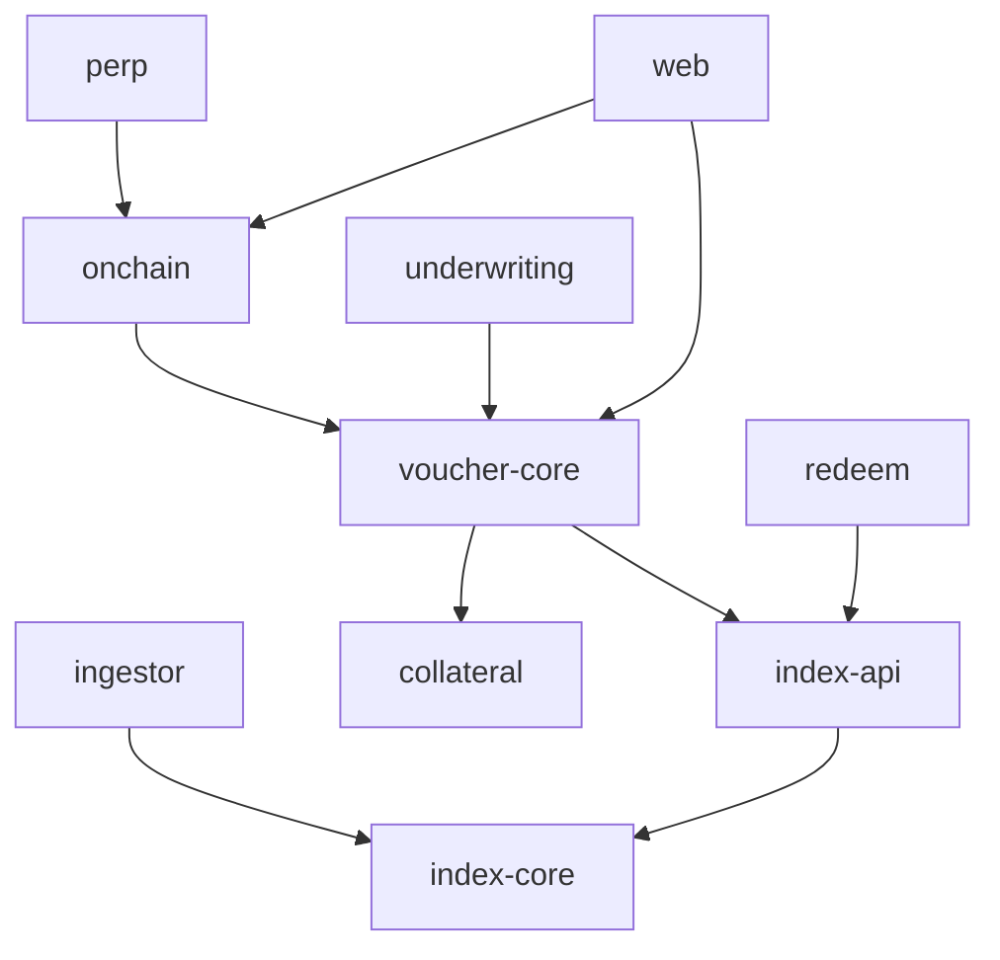

OTE is an **npm-workspaces monorepo**. The docs you're reading live in `apps/docs`. The package
boundaries mirror the [system architecture](/architecture/system-architecture) and its trust
boundary — pure logic is isolated from I/O, and the risky on-chain layer is a leaf package nothing
else depends on.

## Layout

```
open-token-exchange/
├── package.json            # workspaces: apps/*, packages/*
├── apps/
│   ├── docs/               # @ote/docs   — this Mintlify site
│   └── web/                # @ote/web    — buyer marketplace + index dashboard (Phase 1)
└── packages/
    ├── index-core/         # @ote/index-core   — pure methodology (blend, trim, reset study) [Phase 0]
    ├── ingestor/           # @ote/ingestor     — poll OpenRouter + sources → observations    [Phase 0]
    ├── index-api/          # @ote/index-api    — serve reference index + reset study         [Phase 0]
    ├── voucher-core/       # @ote/voucher-core — voucher model, pricing, redemption logic    [Phase 1]
    ├── collateral/         # @ote/collateral   — reserve model backing outstanding vouchers  [Phase 1]
    ├── redeem/             # @ote/redeem       — redemption / inference routing (multi-agg)  [Phase 1]
    ├── onchain/            # @ote/onchain      — voucher token mint/transfer + secondary mkt  [Phase 1.5]
    ├── underwriting/       # @ote/underwriting — book risk, position limits, lay-off         [Phase 2]
    └── perp/               # @ote/perp         — optional HIP-3 perp on the anchored market  [Phase 3]
```

<Info>
Only `apps/docs` exists today (this site). The other packages are the **planned** shape — created
phase by phase. `index-core` is intentionally **pure** (deterministic functions, no I/O) so the
published index is reproducible and unit-testable; the `ingestor` and `index-api` wrap it with I/O.
</Info>

## Dependency direction



<Tip>
**`voucher-core` is the hub; `perp` is a disposable leaf.** Everything routes through the voucher
model, but the optional Phase‑3 `perp` package is a pure leaf — you can build, ship, and operate the
entire voucher product (Phases 0–2) without it, and delete it without touching anything else. The
[redeemable voucher](/architecture/instrument) is what made the on-chain layer safe to bring into the
MVP: it's an asset-backed spot token, not a synthetic bet on a feed.
</Tip>

## Running the docs

```bash
npm install
npm run docs        # → mint dev in apps/docs
```

<Note>
Root scripts proxy into the docs workspace (`docs`, `docs:dev`, `docs:broken-links`). As phases land,
each package adds its own `dev`/`build`/`test` scripts and the root gains `build`/`test` fan-out
across workspaces.
</Note>
