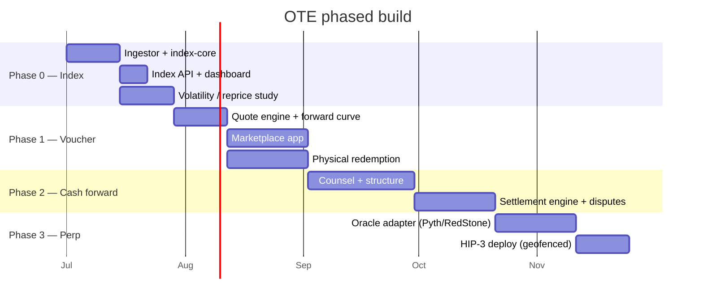

Each phase has an **entry gate** — you don't start it until the prior phase has answered its
question. This is what keeps OTE from betting on unproven assumptions.

## Timeline

<Info>
Dates are illustrative offsets from a ~July 2026 start, not commitments. The point is the **ordering
and the gates**, not the calendar.
</Info>

## Phase gates

<Steps>
<Step title="Gate 0 → 1: Is there anything to trade?">
**Enter Phase 1 only if** the volatility/reprice study shows enough movement to justify a market —
*or* you consciously accept a forward/voucher-only product. **Kill/pivot** if prices are effectively
static between rare step-changes and no buyer wants a lock anyway.
</Step>
<Step title="Gate 1 → 2: Will anyone pay?">
**Enter Phase 2 only if** Phase 1 shows real willingness-to-pay for price-locks, *and* the index has
run cleanly enough to be a settlement reference, *and* counsel is engaged.
</Step>
<Step title="Gate 2 → 3: Is the index trusted?">
**Enter Phase 3 only if** the index is reproduced/relied-on by third parties, hedging demand is
proven, a third-party oracle operator is contracted, and counsel has cleared a geofenced structure.
</Step>
</Steps>

## Risk register (carried from the research)

| Risk | Phase it bites | Mitigation | Status |
|---|---|---|---|
| Underlying lacks tradeable volatility | 0 | Measure first (vol study) | **Open** — Q1 |
| Index manipulation (single-venue) | 2–3 | Multi-source + TWAP + disputes | Designed, unbuilt |
| Oracle trust (deployer-owned) | 3 | Pyth/RedStone operate the feed | Designed, unbuilt |
| US regulatory exposure | 2–3 | Voucher-first; counsel; geofence | **Open** — Q2 |
| No willingness-to-pay | 1 | Voucher MVP tests it cheaply | **Open** — Q4 |
| Physical-settlement economics (fees) | 1 | Model the 5.5%/5% layer into quotes | Designed |

<Note>
"Open" items map to [Open Questions](/architecture/open-questions) and are the agenda for the
`/grill-me` session.
</Note>
