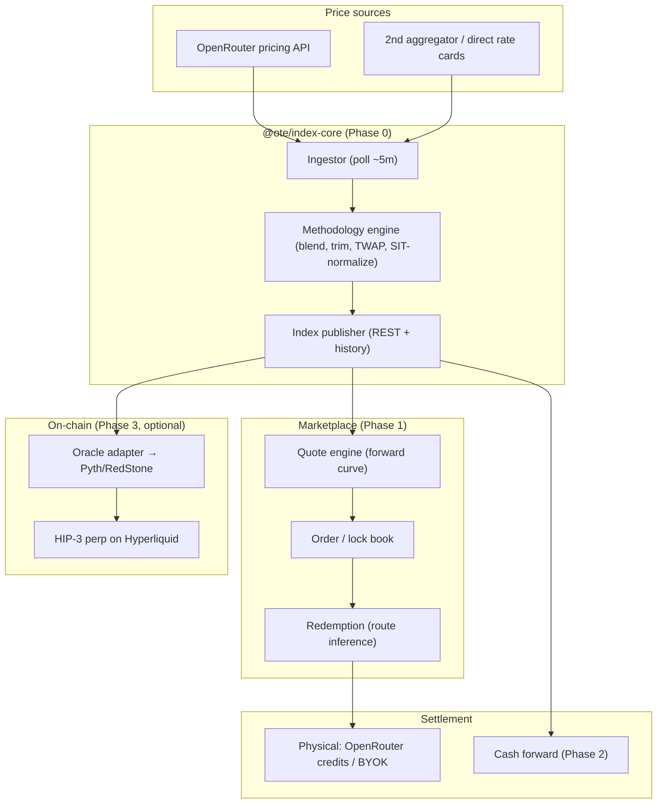
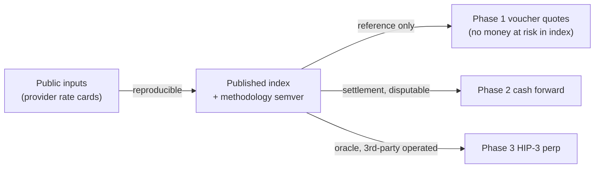

<Note>
**Updated by the voucher decision.** The diagram below was drawn for the original index-settled
plan. Two changes from the `/grill-me` outcome: (1) an **on-chain voucher layer** (mint · redeem ·
collateral · secondary market) moves *into the MVP* (Phase 1), not Phase 3; (2) the **index becomes
a reference feed**, not the settlement oracle — redemption arbitrage does settlement. The component
list and [monorepo layout](/architecture/monorepo) reflect the updated shape; treat the diagram as
the *data-flow skeleton*, with the voucher layer sitting between the marketplace and settlement.
</Note>

## High-level shape

<Info>
The diagram encodes the phasing: **the index (center) is built first and feeds everything.** Physical
settlement (Phase 1) needs no oracle; cash settlement (Phase 2) and the perp (Phase 3) consume the
*same* published index, just with progressively more trust required.
</Info>

## Components

<AccordionGroup>
<Accordion title="Ingestor — @ote/ingestor">
Polls price sources on a fixed cadence, normalizes into `PriceObservation` records, persists a full
history (needed for TWAP, volatility study, and audit). Handles provider availability/staleness.
Idempotent and replayable.
</Accordion>
<Accordion title="Index core — @ote/index-core">
Pure, versioned methodology: blend k-cheapest providers, fixed input:output ratio, outlier trim,
TWAP windows, SIT capability-normalization. **No I/O** — deterministic functions over observations so
the index is reproducible and unit-testable. Emits `IndexPoint`s.
</Accordion>
<Accordion title="Index API — @ote/index-api">
Serves spot + historical index values and the published methodology version. Also exposes the
**volatility/reprice-frequency report** (Phase 0 deliverable). This is the public, trust-building
surface.
</Accordion>
<Accordion title="Quote engine — @ote/quotes">
Builds the **forward curve** from the index + a carry/decline model + a risk premium. Turns "lock
GPT‑5 at $X/M for 3 months, up to N tokens" into a priced, executable quote.
</Accordion>
<Accordion title="Marketplace app — @ote/web">
The buyer-facing app: browse models/classes, see spot + forward curve, buy price-locks / prepay,
manage and redeem positions. Next.js.
</Accordion>
<Accordion title="Redemption — @ote/redeem">
Fulfills physical settlement: routes a buyer's inference through OTE-held OpenRouter credits or BYOK,
metering against their locked balance. Absorbs/accounts for the 5.5%/5% fee layer.
</Accordion>
<Accordion title="Settlement engine — @ote/settlement">
Phase 2+. Computes cash-settlement values against the TWAP index, runs the dispute window, books P&L.
Kept separate from physical redemption.
</Accordion>
<Accordion title="On-chain adapter — @ote/onchain">
Phase 3. Bridges the published index to a HIP‑3 oracle via Pyth/RedStone, manages the perp
deployment. Isolated so the off-chain product never depends on it. See
[HIP‑3 path](/architecture/hip3-perp).
</Accordion>
</AccordionGroup>

## Trust boundary (the thing to get right)

<Warning>
Risk **increases left to right.** In Phase 1, a wrong index value only mis-quotes a forward (caught
by the counterparty). By Phase 3 it directly moves settlement on a leveraged position. The
architecture deliberately lets you **operate and harden the index for months under Phase-1 stakes
before it ever controls money.**
</Warning>

## Tech choices (proposed, open to grilling)

| Concern | Default pick | Note |
|---|---|---|
| Language | TypeScript (whole monorepo) | One toolchain; `index-core` pure & testable |
| Web app | Next.js (`@ote/web`) | Buyer marketplace + index dashboard |
| Storage | Postgres + time-series table | Full observation history for TWAP/vol study |
| Scheduler | Cron/worker for the ingestor | Idempotent, replayable |
| On-chain | Hyperliquid HIP‑3 + Pyth/RedStone | Phase 3 only, isolated package |
| Docs | Mintlify (`@ote/docs`) | This site |

<Info>
These are starting defaults, **not decisions** — chain choice, storage, and whether to build the
perp at all are in [Open Questions](/architecture/open-questions) for the `/grill-me` pass.
</Info>
