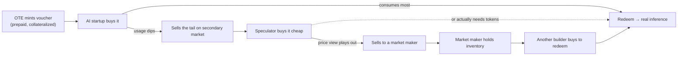

<Note>
Everything below is built on **one instrument** — the [redeemable token-voucher](/architecture/instrument).
Its two primitives are all you need to follow the journeys:
- **Redeem** → consume the locked tokens as real inference.
- **Sell** → transfer the voucher on the secondary market to exit before consuming.

Every user is just a different combination of *mint → (hold) → redeem and/or sell*.
</Note>

## Who uses it, at a glance

| User | Wants | What they do | Exit |
|---|---|---|---|
| **AI startup** (committed-use buyer) | A predictable, below-spot bill | Prepay a voucher on the model they run | **Redeem** (consume) |
| **Agent / coding platform** (high burn) | Protection against an up-move | Prepay a **frontier-basket** voucher | Redeem; **sell** the unused tail |
| **Flexible builder** | Optionality if usage shifts | Prepay, then decide later | Redeem **or** sell |
| **Speculator / trader** | Exposure to token-price direction | Buy/sell vouchers on the secondary market | **Sell** (never consumes) |
| **Market maker** | Spread / fees | Quote both sides of the voucher market | Continuous |
| **Provider** (supply side) | Guaranteed demand | Sell committed-use capacity to OTE | Fulfills redemptions |
| **OTE** (the house, at first) | Margin from the secular decline | Underwrite the short, lay it off | — |

<Info>
The market has **two natural sides**: people who want to *get rid of* token-price risk (buyers seeking
certainty) and people willing to *take it on* (speculators, the provider supply side, and OTE itself).
The voucher is the thing that passes risk from the first group to the second.
</Info>

## Demand side — users who want certainty

<CardGroup cols={2}>
<Card title="The AI startup (primary customer)" icon="rocket">
A Series A/B product whose **#2 cost is inference** and who can't forecast it. They buy certainty.
</Card>
<Card title="The agent / coding platform" icon="robot">
High, spiky token burn on a model their users **depend on** — they can't just route around a price
hike. They buy **up-move protection**.
</Card>
</CardGroup>

### Journey — AI startup locks 6 months of GPT‑5

<Steps>
<Step title="Size the commitment">
Founder expects to burn **~600M GPT‑5 output tokens** over the next two quarters. Spot is **$10/M** and
trending down, but they can't budget on a guess.
</Step>
<Step title="Buy the voucher">
On OTE they buy a voucher: **600M tokens of GPT‑5 at $8/M, 6‑month expiry** — below spot, because OTE
passes through the expected decline. They prepay; OTE posts collateral backing the claim.
</Step>
<Step title="Run on it">
They point their app's inference at OTE. Every request **redeems** against the voucher at the locked
$8/M, no matter where the market goes. Their bill is now a **fixed, known line item.**
</Step>
<Step title="Outcome">
Spot drifts to $6 — they "overpaid" $2/M but got certainty and didn't have to manage it. Or a new
frontier model resets GPT‑5 pricing **up to $14** — they're protected, still paying $8. Either way the
**board sees one predictable number.**
</Step>
</Steps>

### Journey — agent platform hedges a model it can't drop

<Steps>
<Step title="Identify the exposure">
A coding-agent platform's users demand a specific frontier model. If its price jumps, the platform's
**margin collapses** — and they can't substitute a cheaper model without degrading the product.
</Step>
<Step title="Buy a basket voucher">
They prepay a **frontier-basket** voucher (cheaper, more liquid than single-model, and it tracks the
class they actually depend on). They size it to their *expected* burn, not their max.
</Step>
<Step title="Redeem the base, sell the tail">
They **redeem** against it as they consume. If a quiet month leaves headroom unused, they **sell** the
remaining voucher on the secondary market instead of wasting it — recovering capital.
</Step>
</Steps>

## Supply side — users who take the risk on

<CardGroup cols={2}>
<Card title="The speculator / trader" icon="chart-line">
Believes they can read where token prices go. Buys vouchers cheap, sells when the implied price moves
their way. **Never consumes a token** — pure financial exposure, but on an asset-backed instrument.
</Card>
<Card title="The provider (inference supply)" icon="server">
A model provider or aggregator that **wants guaranteed demand**. Sells committed-use capacity to OTE
at a discount — effectively going short its own future price in exchange for a locked customer.
</Card>
</CardGroup>

### Journey — a speculator trades the voucher, never consuming

<Steps>
<Step title="Form a view">
A trader thinks the market is **underpricing the decline** — vouchers are too expensive relative to
where spot will be. (Or the opposite: an upcoming frontier launch will reset prices *up*.)
</Step>
<Step title="Take the position">
They **buy or short** vouchers on the secondary market. Because every voucher is redeemable, its price
can't drift far from real delivery value — so they're trading a **bounded, asset-backed** instrument,
not a number OTE controls.
</Step>
<Step title="Exit before expiry">
They **sell** before the voucher's expiry — they never route inference. Their P&L is the price move.
In doing so they've **absorbed risk a hedger wanted to shed** — they are the other side of the startup's
trade.
</Step>
</Steps>

<Tip>
This is how the venue "earns the right to become an exchange": as speculators and market makers show
up on the secondary market, OTE stops being the *only* counterparty and can **lay off** the
underwriting short it carried at the start. See [Recommendation](/architecture/recommendation).
</Tip>

### Journey — a provider underwrites demand

<Steps>
<Step title="Offer committed capacity">
A provider tells OTE: "I'll guarantee you `X` tokens/month of model `M` at a discounted rate if you
commit." They get **predictable utilization**; OTE gets cheaper supply.
</Step>
<Step title="OTE lays off its short">
OTE backs voucher redemptions with that committed capacity — turning its naked short into a
**back-to-back** position and shrinking its balance-sheet risk. The provider is now effectively the
underwriter for that slice.
</Step>
</Steps>

## The market maker (the lubricant)

<Card title="Quoting both sides" icon="arrows-left-right">
A market maker continuously **bids and offers** vouchers on the secondary market, earning the spread.
They make redemption-anchored prices tight and reliable, so hedgers can exit when they need to and
speculators can enter cheaply. They don't need a view on direction — they need volume and a tight
book.
</Card>

## How a single voucher can serve everyone

<Info>
**The same voucher** can pass from a hedger → a speculator → a market maker → another consumer, being
*traded* several times and finally *redeemed* for the real tokens it always represented. Certainty
flows to whoever wants it; risk flows to whoever will hold it; and the underlying good is delivered at
the end. That circulation is the product.
</Info>

## What each user needs from OTE

| User | The thing OTE must nail for them |
|---|---|
| AI startup | Honest below-spot pricing + reliable redemption (fulfillment across aggregators) |
| Agent platform | A frontier basket that genuinely tracks their bill + easy resale of the tail |
| Speculator | A liquid secondary market + transparent reference index |
| Market maker | Tight, predictable redemption anchoring + low-friction transfer (on-chain) |
| Provider | Real, sized, committed demand to underwrite against |
| OTE (early) | Disciplined [collateral & position limits](/architecture/instrument#collateralization-a-first-class-requirement) while it's the house |
